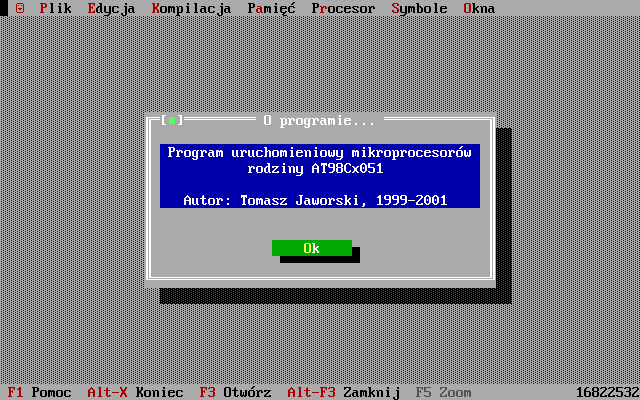

# 8051emu
Repozytorium zwiera środowisko emulatora mikroproceosrów o architekturze **8051** wraz z asemblerem. Oprogramowane zostały trzy wersje kości to:
  * [AT89C2051](http://www.keil.com/dd/docs/datashts/atmel/doc0366.pdf)
  * [AT89C2051](https://ww1.microchip.com/downloads/en/DeviceDoc/doc0368.pdf)
  * [AT89C4051](https://ww1.microchip.com/downloads/en/devicedoc/doc1001.pdf)
  

  
## Opis  

Projekt powstał w 1999-2001, gdy uczęszczałem do szkoły średniej (Technikum Elektroniczne w Kutnie) i miał zastąpić środowisko DSM51, używane na zajęciach z programiwania mikroprocesorów.

Środowisko składa się z dwuprzebiegowego asemblera - komilatora języka asembler w postaci pełnej listy rozkazwów '51 oraz z debuggera. Całość została napisana w języku Borland Pascal 7.0 i pracuje poprawnie w trybie chronionym 16 bitowym pod kontrolą systemu DOS. 

Repozytorium GIT nie zawiera ostatecznej wersji środowiska a jedynie najaktualniejszą wersję źródeł, jaką znalazłem. Nie znałem wtedy koncepcji repozytorii kodów, a GIT miał powstać dopiero za kilka lat ;-). Jeżeli kiedyś natrafię na ostatnią wersję - z pewnąscią ją tutaj opublikuję.

## Kompilacja/uruchomienie

Do kompilacji konieczne jest DOSowe środowisko **Borland Pascal 7.0** (profesjonalny odpwiedni Turbo Pascala) oraz **DOSBox**. Pakiety te można pobrać tutaj:
  * [Borland Pascal 7](https://winworldpc.com/product/borland-pascal/7x)
  * [DOSBox](https://www.dosbox.com/)

#### Konfiguracja DOSBox:

Poniżej znajduje się lista zmian, które *można* wprowadzić do pliku **dosbox.conf**:
```ini
[sdl]
windowresolution=1280x800
output=overlay
hwscale=2.00

autolock=false
sensitivity=100

[cpu]
core=auto
cputype=auto
cycles=fixed 30000
cycleup=10
cycledown=20

[autoexec]
mount c: C
imgmount a: A\floppy.img -t floppy
z:\config -set dos keyboardlayout pl
c:
cd \
call c:\autoexec.bat
```

Zmiany te obejmują:
 * Powiększenie okna symulacji 2x (zoom)
 * Poprawienie współpracy ze sterownikiem myszy w przypadku korzystania z Remote Desktop
 * Przyspieszenie symulacji
 * Uruchomienie polskich czcionek oraz strony kodowej 852.

Powyższe zmiany jedynie uprzyjemniają pracę z całym systemem.


#### Kompilacja
W pierwszej kolejności należy zainstalować pakiet **Borland Pascal** w wersji pełnej. Po zainstalowaniu należy uruchomić środowisko BP poleceniami:
```batch
cd C:\BP\BIN
BP
```
A następnie skompilować i uruchomić:
  * **debugger** - otwrzyć [debug.pas](./8051emu/debug.pas) i go uruchomić.
  * **kompilator** - otworzyć [kompil/kompil51.pas](./8051emu/kompil/kompil51.pas) i go uruchomić.


# Debugger - moduł uruchomieniowy


## Kompilator


## Us

