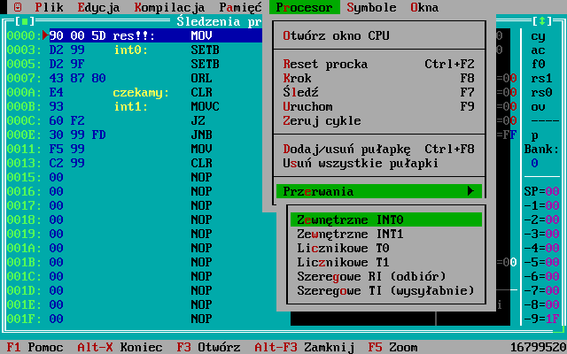

# 8051emu
Repozytorium zwiera środowisko symulatora mikroproceosrów o architekturze **8051** wraz z asemblerem. Oprogramowane zostały trzy wersje kości to:
  * [AT89C2051](http://www.keil.com/dd/docs/datashts/atmel/doc0366.pdf)
  * [AT89C2051](https://ww1.microchip.com/downloads/en/DeviceDoc/doc0368.pdf)
  * [AT89C4051](https://ww1.microchip.com/downloads/en/devicedoc/doc1001.pdf)
  

  
## Opis  

Projekt powstał w 1999-2001, gdy uczęszczałem do szkoły średniej (Technikum Elektroniczne w Kutnie).
Miał on zastąpić środowisko [DSM51](https://pl.wikipedia.org/wiki/Dydaktyczny_System_Mikroprocesorowy) firmy MicroMade,
używane na zajęciach z programiwania mikroprocesorów.

Środowisko składa się z dwuprzebiegowego asemblera - komilatora języka asembler w postaci pełnej listy rozkazwów '51 oraz z debuggera.
Całość napisałem w języku Borland Pascal 7.0 a pracuje one poprawnie w trybie chronionym 16 bitowym, pod kontrolą systemu DOS. 
Do wykonania interfejsu okienkowego wykorzystałem popularny wówczas pakiet [Turbo Vision](https://en.wikipedia.org/wiki/Turbo_Vision).

Repozytorium GIT nie zawiera ostatecznej wersji środowiska a jedynie najaktualniejszą wersję źródeł, jaką znalazłem.
Nie znałem wtedy koncepcji repozytorii kodów, a GIT miał powstać dopiero za kilka lat ;-).
Jeżeli kiedyś natrafię na ostatnią wersję - z pewnąscią ją tutaj opublikuję.

## Kompilacja/uruchomienie

Do kompilacji konieczne jest DOSowe środowisko **Borland Pascal 7.0** (profesjonalny odpwiedni Turbo Pascala) oraz **DOSBox**. Pakiety te można pobrać tutaj:
  * [Borland Pascal 7](https://winworldpc.com/product/borland-pascal/7x)
  * [DOSBox](https://www.dosbox.com/)

#### Konfiguracja DOSBox:

Poniżej znajduje się lista zmian, które *można* wprowadzić do pliku **dosbox.conf**:
```ini
[sdl]
windowresolution=1280x800
output=overlay
hwscale=2.00

autolock=false
sensitivity=100

[cpu]
core=auto
cputype=auto
cycles=fixed 30000
cycleup=10
cycledown=20

[autoexec]
mount c: C
imgmount a: A\floppy.img -t floppy
z:\config -set dos keyboardlayout pl
c:
cd \
call c:\autoexec.bat
```

Zmiany te obejmują:
 * Powiększenie okna symulacji 2x (zoom)
 * Poprawienie współpracy ze sterownikiem myszy w przypadku korzystania z Remote Desktop
 * Przyspieszenie symulacji
 * Uruchomienie polskich czcionek oraz strony kodowej 852.

Powyższe zmiany jedynie uprzyjemniają pracę z całym systemem i nie są konieczne do jego kompilacji i uruchomienia.


#### Kompilacja
W pierwszej kolejności należy zainstalować pakiet **Borland Pascal** w wersji pełnej. Po zainstalowaniu należy uruchomić środowisko BP poleceniami:
```batch
cd C:\BP\BIN
BP
```
A następnie skompilować i uruchomić:
  * **debugger** - otwrzyć [DEBUG.PAS](./8051emu/DEBUG.PAS), skompilować i uruchomić.
  * **kompilator** - otworzyć [KOMPIL/KOMPIL51.PAS](./8051emu/kOMPIL/KOMPIL51.PAS), skompilować i uruchomić.

W wyniku kompilacji wygenerowane zostaną pliki **debug.exe** oraz **kompil51.exe** - właściwe pliki wykonywalne.

# Debugger - moduł uruchomieniowy

Po uruchomieniu skompilowanego debuggera, bezpośrednio z poiomu IDE Pascala lub plikiem **debug.exe** środowisko przywita się następującym widokiem.


Cechy debuggera:
 * Emulacja architektury 8051 na poziomie sprzętowym wraz z liczeniem cykli.
   Pozwala to dokładnie określić czas działania kodu, co jest krytyczne w przypadku budowania systemów czasu rzeczywistego.
 * Możliwość wczytywania plików wykonywalnych w formacie [Intel HEX](https://pl.wikipedia.org/wiki/Intel_Hex) oraz w formacie RAW (binarne zrzuty pamięci).
 * Możliwość zapisywania plików wykonywalnych w formatach BIN/HEX.
 * Możliwość wczytywania symboli z plików generowanych przez kompilator **kompil51** (pliki `.SYM`);
   wczytane symbole można w pełni edytować i ponownie zapisywać na dysk.

 * Możliwość pracy debuggera krok po kroku oraz z animacją śleczdzenia.
 * Możliwość edycji zawartości pamięci RAM (danych) oraz ROM (kodu programu).
 * Pełna interaktywność środowiska - na zmiany  zawartości rejestrów RAM/pamięci ROM natychmiast reagowały pozostałe elementy interfejsu, np. poprzez aktualizację zawartości okna śledzenia stanu CPU.
 * Okno śledzenia stanu CPU wyświetla nazwy symboli w miejsa adresów, co znacząco ułatwia proces debugowania.

###### Widoki aplikacji

Okno debuggera - śledzenia stanu i pracy mikroproceosra po wczytaniu programu.


Możliwość dodawania wielu pułapek, na których następnie program się zatrzymywał.


Możliwość generowania przerwań zewnętrznych jak i wewnętrznych. 



Edytor pamięci ROM (programu):


Edytor pamięci RAM (rejestry, pamięć ogólnego przeznaczenia):


Wczytaną pamięć programu można w każdej chwili zmodyfikować tak, aby wprowadzić drobne zmiany bez konieczności ponownej kompilacji i restartu symulacji mikroprocesora.


W oknie stanu mikroprocesora można zmienić wartość każdego rejestru (tutaj *P3*), flag, numeru banku pamięci oraz stosu.


Do wczytanego programu można dodać/usuwać symbole.


Można je też edytować; symbole podzielone są na dwa zbiory - dla przestrzeni RAM oraz ROM, co jest naturalną konsekwencją [harwardzkiej](https://en.wikipedia.org/wiki/Harvard_architecture) architektury 8051.


Program można uruchomić w trybie pracy ciągłej - wykonuje się sam do jego przerwania lub natrafienia na pułapkę.


###### Animacje

Animacja przedstawiająca proces wczytywania pliku wykonywalnego w formacie Intel HEX wraz z listą symboli. 
Po pomyślnym wczytaniu uruchamiana jest opcja animacji wykonywania kodu (*Uruchom*).


Nie ma dobrego środowiska uruchomieniowego bez pułapek, prawda? Prawda! A skoro tak, to tutaj widać
chwilę ustawienia pułapki oraz wstrzymywanie procesu wykonywania po natrafienia na nią.


Zastosowanie środowiska Turbo Vision oraz mechamizmu wymiany komunikatów ułatwiło zachowanie interaktywności.
Poniżej widać, jak zmiany stanu pamięci RAM procesora natychmiast wpływają na zawartość okna podglądu pamięci RAM jak i na zawartość okna śledzenia CPU.


## Kompilator

Jest to typowy kompilator dwuprzebiegowy.
W pierwszym przebiegu następuja kompilacja kodu, co pozwala na określenie adresów wszystkich symboli.
W drugim natomiast następuje uzupełnienie informacji adresowe w generowanym kodzie oraz jego faktyczne wygenerowanie.

Ciekawe elementy:
 * wbudowany preprocesor - można rekurencyjnie dołączać pliki nagłówkowe (taki odpowiedni `#include` z C/C++)
 * możliwość wykorzystania wyrażeń całkowitych (np. `2 * (2 + 2)`) jako wyrażń liczbowych.

W wersji repozytorium kompilator zafiksowany jest na AT89C2051 oraz plik TEST.ASM. 

-------------------

Podczas pisania kodu można wybrać jeden z kilku predefiniowanych mikroprocesorów:


Do pisania kodu można wykorzystać wbudowany w Turbo Vision edytor.


Podczas kompilacji kompilator generuje następujące komunikaty podsumowujące.

Tutaj wszystko poszło po myśli autora kodu :)

## Cechy wersji ostateczniej
Poniżej znajduje się lista cech, które posiadała wersja ostateczna a która gdzieś zaginęła.
 * Pełna integracja kompilatora z debuggerem (działająca funkcja *Kompiluj*)
 * Współpraca z modułem DSM51.
 * Symulacja peryferiów DSM51 (nie pamiętam już których).
 * Programator AT89Cx051 podłączany do portu LPT (to było programowanie High Voltage, chyba...)
 

## Wnioski
Jeżeli szukasz przykładu jak budować symulatory, to ten kod nie jest najlepszym miejscem :) Choćby z tego powodu, że Pascala nikt już nie używa.
Pamiętam, że pod koniec miałem problem z modułowością oraz brakiem abstrakcji - kod ma wiele miejsc wyspecjalizowanych do podrodziny AT90C, brak zasady *jedna klasa = jeden plik*, itd...
To była najważniejsza lekcja, jaką otrzymałem w tym projekcie :-)

Zarówno sam silnik wykonawczy debuggera jak i kompilator pisałem według własnych pomysłów - nigdy wcześniej tego nie robiłem.
A o książce ze smokiem - [Kompilatory. Reguły, metody i narzędzia, Aho Alfred V. i inni](https://ksiegarnia.pwn.pl/Kompilatory,792842244,p.html) dowiedziałem się dopiero na studiach.

Jeżeli jednak chcesz skorzystać i tych źródeł - powodzenia! I napisz maila; może będę mógł jakoś pomóc. :)

